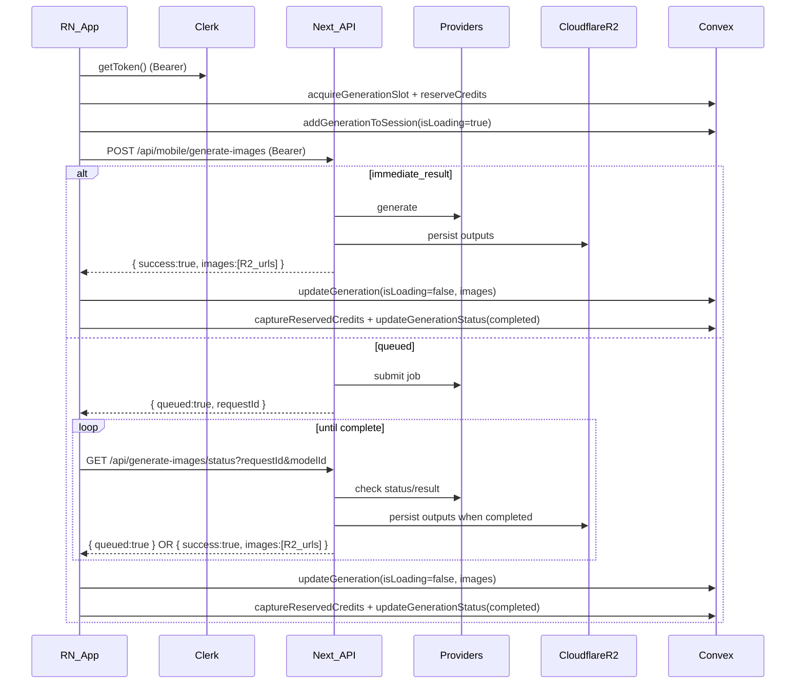

# React Native mobile plan (Image Generation parity)

## Goals

- **Match the web Images experience**: prompt → choose model/options → instant “loading” tile → queued polling → final gallery/grid, with the same model constraints and error behavior.
- **Add all web image models** to mobile (IDs + labels + per-model requirements).
- **No Convex code changes required for mobile**: mobile consumes existing queries/mutations.
- **Mobile-friendly backend**: add **mobile-only API routes** that use **Clerk auth + rate limiting** and **skip Turnstile**, so the RN app doesn’t need Turnstile.

## Source of truth (existing contracts to mirror)

- **Image generation API (web)**:
- Create: [`src/app/api/generate-images/route.ts`](src/app/api/generate-images/route.ts)
- Queued status: [`src/app/api/generate-images/status/route.ts`](src/app/api/generate-images/status/route.ts)
- Model registry + ID resolving: [`src/app/api/generate-images/shared.ts`](src/app/api/generate-images/shared.ts)
- **Image model IDs**: [`src/config/model-ids.ts`](src/config/model-ids.ts)
- **UI behavior to match**:
- Generation orchestration (slots/credits/polling): [`src/components/content-grid.tsx`](src/components/content-grid.tsx)
- Model list + per-model constraints: [`src/components/image-prompt-bar.tsx`](src/components/image-prompt-bar.tsx)
- **Convex schema + mutations used (no changes)**:
- Tables/fields: [`convex/schema.ts`](convex/schema.ts) (especially `sessions`, `sessionGenerations`, `generations`)
- Sessions: [`convex/sessions.ts`](convex/sessions.ts) (`createSession`, `addGenerationToSession`, `updateGeneration`, etc.)
- Concurrency slots: [`convex/generations.ts`](convex/generations.ts) (`acquireGenerationSlot`, `updateGenerationStatus`)
- Credits reservation: [`convex/users.ts`](convex/users.ts) (`reserveCredits`, `captureReservedCredits`, `releaseReservedCredits`)

## Architecture (mobile ↔ backend ↔ Convex)

## Backend work (no Convex edits)

### 1) Add mobile-only image generation route (skip Turnstile)

- **Create** [`src/app/api/mobile/generate-images/route.ts`](src/app/api/mobile/generate-images/route.ts).
- Behavior:
- Require Clerk auth (same as web).
- Apply the same per-user rate limits as web (`checkRateLimit`).
- **Do not call** `verifyTurnstileToken`.
- Reuse the existing model resolution + registry from [`src/app/api/generate-images/shared.ts`](src/app/api/generate-images/shared.ts).
- Keep request/response shape aligned with web `POST /api/generate-images` so mobile can share one client.

### 2) Add mobile-only presign route for attachments (skip Turnstile)

- **Create** [`src/app/api/mobile/r2-presign/route.ts`](src/app/api/mobile/r2-presign/route.ts).
- This mirrors [`src/app/api/r2-presign/route.ts`](src/app/api/r2-presign/route.ts) but:
- Requires Clerk auth + rate limiting.
- Skips Turnstile.
- Mobile uses this to upload 1–10 reference images without JSON body size issues.

### 3) Keep existing status route for polling

- Mobile continues to use the existing **Turnstile-free** status endpoint:
- [`src/app/api/generate-images/status/route.ts`](src/app/api/generate-images/status/route.ts)

### 4) Provider request details (how the backend calls Fal/Azure/Wavespeed)

**The RN app should not call Fal directly.** It should call your Next API routes; those routes already know how to talk to each provider and return **R2-backed URLs**.

#### Fal setup (server-side)

- **Credentials**: ensure `FAL_KEY` (or `FAL_API_KEY`) is set in your Next runtime env.
- **Client config**: call `fal.config({ credentials: apiKey })` at the top of the route (several other routes already do this pattern).
- **Payload shape** (all Fal calls): `{ input: { ...modelSpecificFields }, logs: true }`.

#### Fal “sync” vs “queued” calls

- **Sync models** use `fal.subscribe(endpoint, payload)` and return images immediately.
- **Queued models** use `fal.queue.submit(endpoint, payload)` and return `{ queued:true, requestId }`.
  - Mobile (and web) then polls `GET /api/generate-images/status?requestId&modelId=...` which uses `fal.queue.status` + `fal.queue.result` and rehosts outputs to R2.

#### Non-Fal providers used by image models

- **Wavespeed** (Imagen 3): `POST https://api.wavespeed.ai/api/v3/google/imagen3` returns `requestId`; the existing status route polls `GET https://api.wavespeed.ai/api/v3/predictions/{id}/result` and uploads outputs to R2.
- **Azure OpenAI** (GPT-Image 1): the existing generator route calls your Azure endpoint(s), receives base64, and uploads to R2.

### 5) Complete Image Model Matrix (IDs, endpoints, request mode, characteristics)

Use this as the **single checklist** for “did we add every model + its required UI/params?”

**Request body (mobile → Next):**

- `prompt: string`
- `model: ImageModelId` (from [`src/config/model-ids.ts`](src/config/model-ids.ts))
- `aspectRatio?: "21:9" | "1:1" | "16:9" | "9:16" | "3:4" | "4:3" | "3:2" | "2:3" | "5:4" | "4:5"`
- `numImages?: number`
- `attachmentImages?: Array<{ url: string }>` (mobile should upload via `/api/mobile/r2-presign` then pass URLs)
- `resolution?: "1K" | "2K" | "4K"` (only some models)
- `quality?: "medium" | "high"` (GPT‑Image 1.5)

**VALID_ASPECT_RATIOS** (from [`src/app/api/generate-images/shared.ts`](src/app/api/generate-images/shared.ts)): `["21:9","1:1","16:9","9:16","3:4","4:3","3:2","2:3","5:4","4:5"]`

| ModelId | Label (web) | Provider | Endpoint (server) | Call type | Attachments | Aspect ratios | Options / constraints |
|---|---|---|---|---|---|---|---|
| `img-imagen4-preview` | Imagen 4 | Fal | `fal-ai/imagen4/preview` | **sync** (`fal.subscribe`) | **No** | `1:1, 4:3, 3:4, 16:9, 9:16` | Payload: `{ prompt, aspect_ratio, num_images }` |
| `img-imagen3` | Imagen 3 | Wavespeed | `wavespeed/imagen3` | **queued** (Wavespeed job + status poll) | **No** | `VALID_ASPECT_RATIOS` | Server caps `num_images` to **4** |
| `img-nano-banana` | Nano Banana | Fal | `fal-ai/gemini-25-flash-image` | **queued** (`fal.queue.submit`) | No | `VALID_ASPECT_RATIOS` | `{ prompt, aspect_ratio, num_images }` |
| `img-nano-banana-edit` | Nano Banana Edit | Fal | `fal-ai/gemini-25-flash-image/edit` | **queued** | **Yes (≥1)** | `VALID_ASPECT_RATIOS` | `{ prompt, image_urls, aspect_ratio, num_images }` |
| `img-nano-banana-pro` | Nano Banana Pro | Fal | `fal-ai/nano-banana-pro` | **queued** | No | `VALID_ASPECT_RATIOS` | Adds `resolution: "1K"|"2K"|"4K"` |
| `img-nano-banana-pro-edit` | Nano Banana Pro Edit | Fal | `fal-ai/nano-banana-pro/edit` | **queued** | **Yes (≥1)** | `VALID_ASPECT_RATIOS` | Adds `resolution` + `image_urls` |
| `img-seedream-v4` | Seedream v4 | Fal | `fal-ai/bytedance/seedream/v4/text-to-image` | **queued** | No | `1:1, 4:3, 3:4, 16:9, 9:16` | Uses `image_size:{w,h}` via `getSeedreamImageSize()` |
| `img-seedream-v4-edit` | Seedream v4 Edit | Fal | `fal-ai/bytedance/seedream/v4/edit` | **queued** | **Yes (≥1, up to 10)** | `1:1, 4:3, 3:4, 16:9, 9:16` | `{ prompt, image_urls, image_size, num_images, sync_mode:false }` |
| `img-seedream-v45` | Seedream v4.5 | Fal | `fal-ai/bytedance/seedream/v4.5/text-to-image` | **queued** | No | `1:1, 4:3, 3:4, 16:9, 9:16` | Uses `image_size` enum, sets `max_images=num_images` |
| `img-seedream-v45-edit` | Seedream v4.5 Edit | Fal | `fal-ai/bytedance/seedream/v4.5/edit` | **queued** | **Yes (≥1, up to 10)** | `1:1, 4:3, 3:4, 16:9, 9:16` | Same as v4.5 + `image_urls`, `sync_mode:false` |
| `img-flux-kontext-pro` | FLUX Kontext Pro | Fal | `fal-ai/flux-pro/kontext` | **sync** | **Yes (exactly 1 used)** | `1:1, 4:3, 3:4, 16:9, 9:16` | `{ prompt, image_url, aspect_ratio, num_images, guidance_scale:6.5, num_inference_steps:28 }` |
| `img-gpt-image-1` | GPT‑Image 1 | Azure | `AZURE_BASE_URL` | **sync** (HTTP) | No | **Only** `1:1, 4:3, 3:4` | Maps to sizes `1024x1024 / 1536x1024 / 1024x1536` |
| `img-gpt-image-1-edit` | GPT‑Image 1 Edit | Azure | `AZURE_IMAGE_EDITS_URL` (or derived) | **sync** (multipart HTTP) | **Yes (exactly 1)** | n/a | Uploads base64 result to R2 |
| `img-gpt-image-1-5` | GPT‑Image 1.5 | Fal | `fal-ai/gpt-image-1.5` | **queued** | No | **Only** `1:1, 4:3, 3:4` | Supports `quality:"medium"|"high"`, `image_size` mapping |
| `img-gpt-image-1-5-edit` | GPT‑Image 1.5 Edit | Fal | `fal-ai/gpt-image-1.5/edit` | **queued** | **Yes (≥1)** | **Only** `1:1, 4:3, 3:4` | Supports `quality`, `image_urls`, `image_size:"auto"|...` |
| `img-hunyuan-v21` | Hunyuan Image 2.1 (not in current web picker) | Fal | `fal-ai/hunyuan-image/v2.1/text-to-image` | **sync** | No | `1:1, 4:3, 3:4, 16:9, 9:16` | Adds defaults: negative prompt, steps, guidance |
| `img-hunyuan-v3` | Hunyuan Image 3.0 | Fal | `fal-ai/hunyuan-image/v3/text-to-image` | **sync** | No | `1:1, 4:3, 3:4, 16:9, 9:16` | Uses `sync_mode:true` (base64) then uploads to R2 |
| `img-wan-v22-a14b` | Wan v2.2 A14B (not in current web picker) | Fal | `fal-ai/wan/v2.2-a14b/text-to-image` | **sync** (default Fal flow) | No | `1:1, 4:3, 3:4, 16:9, 9:16` | Uses default Fal payload `{ prompt, aspect_ratio, num_images }` unless you add a special-case |
| `img-reve` | Reve | Fal | `fal-ai/reve/text-to-image` | **sync** | No | `1:1, 4:3, 3:4, 16:9, 9:16` | Uses `sync_mode:true` (may return base64) then uploads to R2 |
| `img-reve-edit` | Reve Edit | Fal | `fal-ai/reve/edit` or `fal-ai/reve/remix` | **sync** | **Yes (≥1)** | `1:1, 4:3, 3:4, 16:9, 9:16` | **1 image** → edit (`image_url`), **2+ images** → remix (`image_urls` + `aspect_ratio`) |
| `img-kling-o1` | Kling O1 Image Edit | Fal | `fal-ai/kling-image/o1` | **queued** | **Yes (≥1, up to 10)** | `16:9, 9:16, 1:1, 4:3, 3:4, 3:2, 2:3, 21:9` | Supports `resolution:"1K"|"2K"`, caps `num_images` to **4** |
| `img-flux-2-max` | Flux 2 Max | Fal | `fal-ai/flux-2-max` | **queued** | No | `1:1, 4:3, 3:4, 16:9, 9:16` | Uses `image_size` enum + `output_format:"jpeg"` |
| `img-flux-2-max-edit` | Flux 2 Max Edit | Fal | `fal-ai/flux-2-max/edit` | **queued** | **Yes (≥1, up to 10)** | `1:1, 4:3, 3:4, 16:9, 9:16` | Uses `image_urls.slice(0,10)` + `output_format:"jpeg"` |

## Mobile work (integrate into your existing UI)

### 1) Shared model list (add ALL models)

- Mobile should support **every `ImageModelId`** from [`src/config/model-ids.ts`](src/config/model-ids.ts).
- Recommended: extract the web’s `IMAGE_MODELS` metadata (label/description/company/isNew) from [`src/components/image-prompt-bar.tsx`](src/components/image-prompt-bar.tsx) into a reusable module (e.g. `shared/image-models.ts`) so web + mobile stay in sync.
- Models to include (IDs):
- `img-imagen4-preview`, `img-imagen3`
- `img-nano-banana`, `img-nano-banana-edit`, `img-nano-banana-pro`, `img-nano-banana-pro-edit`
- `img-seedream-v4`, `img-seedream-v4-edit`, `img-seedream-v45`, `img-seedream-v45-edit`
- `img-flux-kontext-pro`
- `img-gpt-image-1`, `img-gpt-image-1-edit`, `img-gpt-image-1-5`, `img-gpt-image-1-5-edit`
- `img-hunyuan-v21`, `img-hunyuan-v3`, `img-wan-v22-a14b`
- `img-reve`, `img-reve-edit`
- `img-kling-o1`
- `img-flux-2-max`, `img-flux-2-max-edit`

**UI metadata (from web `IMAGE_MODELS` in [`src/components/image-prompt-bar.tsx`](src/components/image-prompt-bar.tsx)):**

| ModelId | Company | Label | Description | Logo | isNew |
|---|---|---|---|---|---|
| `img-gpt-image-1-5` | OpenAI | GPT-Image 1.5 | OpenAI's latest image generation with quality tiers | `/openai.svg` | true |
| `img-gpt-image-1-5-edit` | OpenAI | GPT-Image 1.5 Edit | OpenAI's latest image editing with quality tiers | `/openai.svg` | true |
| `img-flux-2-max` | FLUX | Flux 2 Max | State-of-the-art image generation with exceptional realism and precision | `/flux.svg` | true |
| `img-flux-2-max-edit` | FLUX | Flux 2 Max Edit | Advanced Flux 2 Max editing with up to 10 reference images | `/flux.svg` | true |
| `img-kling-o1` | Kling | Kling O1 Image Edit | Advanced image editing with @Image1, @Image2 references (up to 10 images) | `/kling.svg` | true |
| `img-nano-banana-pro` | Google | Nano Banana Pro | Google's new state-of-the-art image generation model (1K/2K/4K) | `/googleg.svg` | true |
| `img-nano-banana-pro-edit` | Google | Nano Banana Pro Edit | Google's new state-of-the-art image editing model (1K/2K/4K) | `/googleg.svg` | true |
| `img-seedream-v45` | ByteDance | Seedream v4.5 | Latest generation with unified architecture for image creation | `/bytedance-color.svg` | true |
| `img-seedream-v45-edit` | ByteDance | Seedream v4.5 Edit | Advanced multi-image editing with up to 10 reference images | `/bytedance-color.svg` | true |
| `img-nano-banana` | Google | Nano Banana | Fast text-to-image generation with aspect ratio control | `/googleg.svg` | false |
| `img-nano-banana-edit` | Google | Nano Banana Edit | Advanced image editing with aspect ratio control | `/googleg.svg` | false |
| `img-imagen4-preview` | Google | Imagen 4 | Standard quality, faster generation | `/googleg.svg` | false |
| `img-imagen3` | Google | Imagen 3 | Google's most realistic image generation model | `/googleg.svg` | false |
| `img-hunyuan-v3` | Tencent | Hunyuan Image 3.0 | Tencent's latest text-to-image model with fast sync generation | `/hunyuan.svg` | false |
| `img-reve` | Reve | Reve | Detailed visual output with strong aesthetic quality and accurate text rendering | `/donereve.png` | false |
| `img-reve-edit` | Reve | Reve Edit | Edit and transform images with text prompts (1-10 reference images) | `/donereve.png` | false |
| `img-seedream-v4` | ByteDance | Seedream v4 | High-res 2K+ with strong text layout | `/bytedance-color.svg` | false |
| `img-seedream-v4-edit` | ByteDance | Seedream v4 Edit | Multi-image editing (up to 10 refs) | `/bytedance-color.svg` | false |
| `img-flux-kontext-pro` | FLUX | FLUX Kontext Pro | Advanced image-to-image editing model | `/flux.svg` | false |
| `img-gpt-image-1` | OpenAI | GPT-Image 1 | OpenAI text-to-image generation | `/openai.svg` | false |
| `img-gpt-image-1-edit` | OpenAI | GPT-Image 1 Edit | OpenAI image editing | `/openai.svg` | false |

**Not in current web picker**: `img-hunyuan-v21`, `img-wan-v22-a14b` (they exist in [`src/config/model-ids.ts`](src/config/model-ids.ts) + [`src/app/api/generate-images/shared.ts`](src/app/api/generate-images/shared.ts), but aren’t listed in `IMAGE_MODELS` yet).

### 2) Build a mobile “generation engine” hook/service

Implement a single orchestrator mirroring [`src/components/content-grid.tsx`](src/components/content-grid.tsx):

- **Before starting**
- `api.generations.acquireGenerationSlot({ type:"image" })`
- `api.users.reserveCredits({ amount: calculateImageCost(...) })`
- Ensure a session exists (use your existing sessions UI + `api.sessions.createSession` fallback).
- Persist a loading generation in Convex: `api.sessions.addGenerationToSession({ isLoading:true, ... })`.
  - **Important for mobile**: store `externalRequestId` (for resume) but **omit `providerEndpoint`** so Convex doesn’t schedule its own Fal polling (which can store temporary provider URLs). Mobile will poll via Next status route and then update Convex with **R2 URLs**.
- **Start generation**
- Call `POST /api/mobile/generate-images` with model/options/attachments.
- **Queued polling**
- If `{ queued:true }`, poll `GET /api/generate-images/status` using the same backoff policy as web (`POLLING_CONFIGS.image` in [`src/lib/polling-policy.ts`](src/lib/polling-policy.ts)), until success or hard timeout.
- **On success**
- Update Convex generation: `api.sessions.updateGeneration({ isLoading:false, images, completedAt })`.
- Capture credits: `api.users.captureReservedCredits({ amount })`.
- Close slot: `api.generations.updateGenerationStatus({ status:"completed", imageUrl:firstImageUrl })`.
- **On failure**
- Remove/mark failed generation in Convex (match your existing web behavior).
- Release credits: `api.users.releaseReservedCredits({ amount })`.
- Close slot as failed.

### 3) Attachments (for edit models)

- For models requiring input images (Nano Banana Edit/Pro Edit, Flux Kontext Pro, Seedream Edit, GPT Edit, Reve Edit, Kling O1, Flux 2 Max Edit):
- Use `POST /api/mobile/r2-presign` → upload via `PUT` to R2 → pass the returned public URLs as `attachmentImages: [{ url }]`.
- Enforce the same limits as web (e.g., Kling O1 up to 10 images, numImages caps, allowed aspect ratios).

### 4) UI parity checklist (hook into your existing screens)

- **Model picker**: searchable list + “new” badges + per-model description (from web).
- **Controls**:
- Aspect ratio options depend on model (see logic in [`src/components/image-prompt-bar.tsx`](src/components/image-prompt-bar.tsx) around `allowedAspectOptions`).
- Quality toggle for GPT-Image 1.5 models.
- Resolution picker for Nano Banana Pro / Kling O1 (mirror web).
- Disable generate until required attachments are present (same rules as web).
- **Kling O1 mentions**: detect `@Image1..@Image10` in prompt and warn if missing referenced images (same as web).
- **Grid**: skeleton tiles for `isLoading`; tap to open fullscreen carousel.

### 5) Persistence/resume

- Store last-used settings in AsyncStorage using the same semantics as the web keys (model id, aspect ratio, numImages, resolution, quality).
- On app resume: scan loaded generations for `isLoading && externalRequestId` and resume polling so abandoned queued jobs still complete.

## Rollout/testing

- Validate end-to-end with at least one model in each category:
- Text-to-image (Imagen 4)
- Queued FAL model (Nano Banana)
- Multi-image edit (Seedream v4.5 Edit)
- Kling O1 Image with `@Image1` references
- GPT-Image 1.5 with quality toggle
- Confirm Convex invariants:
- Slots always end in completed/failed
- Reserved credits always end captured/released