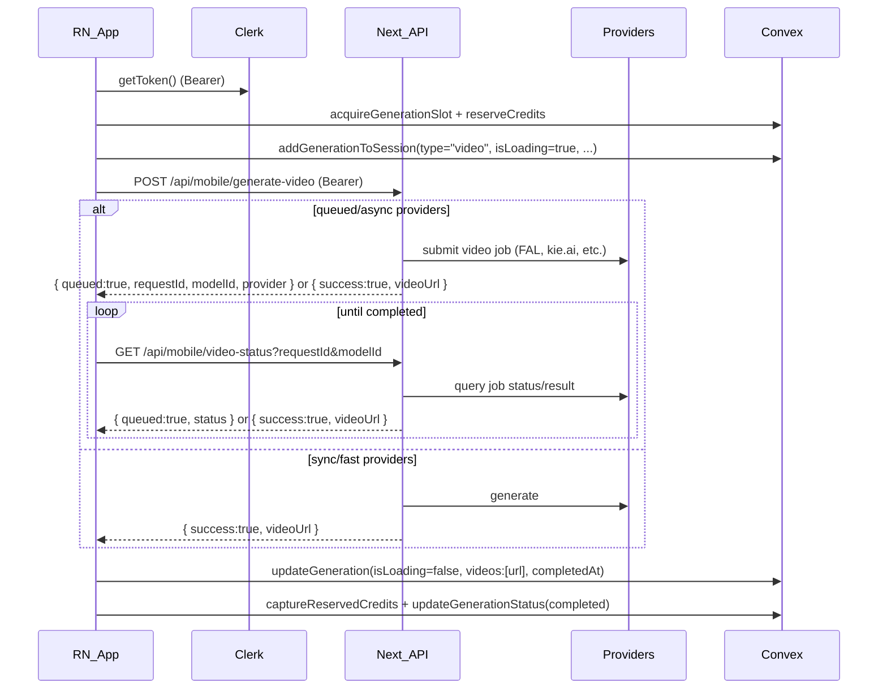

# React Native mobile plan (Video Generation parity)

## Goals

- **Match the web Videos page experience**: prompt → choose video model/options → instant loading tile in the grid → queued/async handling → final video saved into the same Convex `sessions/sessionGenerations` as web.
- **Support all web video models** from `VIDEO_MODELS` / `VIDEO_MODEL_IDS` (Kling, Veo, Wan, Sora 2, Seedance, Lucy, Ovi, etc.), including text-to-video, image-to-video, and transition modes.
- **Reuse existing Convex logic** for sessions, concurrency slots, and credits (no Convex changes for mobile).
- **Use mobile-friendly backend routes** similar to images: mobile calls Next.js API routes (Clerk-auth, no Turnstile) which in turn call FAL/Wavespeed/kie.ai providers.

## Source of truth (web video flow)

- **Video page + sessions flow**: [`src/app/videos/page.tsx`](src/app/videos/page.tsx)
- Uses `VideoPromptBar` + `ContentGrid` + `useSessions("video")` + `calculateVideoCost`.
- **Video prompt bar + model list + per-model UI rules**: [`src/components/video-prompt-bar.tsx`](src/components/video-prompt-bar.tsx)
- `VIDEO_MODELS` (IDs, labels, descriptions, specs).
- Attachments (`attachmentImage`, start/end frames, Kling O1 images/elements/video).
- Aspect ratio, duration, resolution, audio, fast mode, watermark toggles.
- **Shared content grid / orchestration**: [`src/components/content-grid.tsx`](src/components/content-grid.tsx)
- Already handles `type: "video"` including:
    - `acquireGenerationSlot`, `reserveCredits`, `captureReservedCredits`, `releaseReservedCredits`.
    - Calling `/api/fal-generate-videos`, `/api/pixverse-video`, `/api/kie-sora-2`.
    - Persisting/updating Convex `sessionGenerations`.
- **Video backend entrypoint**: [`src/app/api/fal-generate-videos/route.ts`](src/app/api/fal-generate-videos/route.ts)
- Maps friendly model IDs to FAL endpoints (`getVideoModelEndpoint`) and special FAL routes (Lucy, Wan, Seedance, Kling O1, Sora 2, etc.).
- Handles text-to-video, image-to-video, transitions, Kling O1 reference modes, Seedance transitions.
- Uses Turnstile + Clerk + per-user rate limits.
- **Video credit pricing**: [`src/lib/credit-costs.ts`](src/lib/credit-costs.ts)
- `calculateVideoCost(model, resolution, hasAudio, duration, fastMode, removeWatermark)` per `VIDEO_MODEL_IDS`.

## Architecture (mobile ↔ backend ↔ Convex for video)

## Backend work (no Convex edits)

### 1) Add mobile-only video generation route (skip Turnstile)

- **Create** `src/app/api/mobile/generate-video/route.ts`.
- Behavior:
- Require **Clerk auth** (same as `/api/fal-generate-videos`).
- Apply **per-user rate limiting** similar to web (`vid-fal:1m`, `vid-fal:1h`).
- **Remove Turnstile**: do not call `verifyTurnstileToken` (mobile apps can’t run Turnstile).
- Accept a request body compatible with `VideoPromptBar` and RN client:
    - `model` (one of `VIDEO_MODEL_IDS`)
    - `prompt`
    - `aspectRatio`, `duration`, `resolution`, `generateAudio`, `cameraFixed`, `fastMode`, `removeWatermark`
    - `attachmentImageUrl` / `attachmentImageBytes` (image-to-video)
    - `startFrameImageUrl` / `endFrameImageUrl` (transitions)
    - `klingO1Images`, `klingO1Elements`, `klingO1Video` for Kling O1 modes.
- Internally **reuse** the logic from `/api/fal-generate-videos/route.ts`:
    - Same **modelEndpoint** resolution via `VIDEO_MODEL_IDS` + `getVideoModelEndpoint`.
    - Same request payloads (durations, aspect ratios, resolution mapping, audio flags, Kling O1 modes, Seedance Pro, Lucy, Wan, Sora 2, etc.).
- Response shape for RN should match web expectations:
    - Success: `{ success: true, videos: [{ url }], modelId, duration, resolution, provider?: string }`.
    - Queued: `{ queued: true, requestId, modelId, provider, endpoint? }`.

### 2) Add mobile-only video status route (optional but recommended)

- **Create** `src/app/api/mobile/video-status/route.ts`.
- Behavior:
- Require Clerk auth.
- Accept `requestId` + `modelId` (and optionally `provider`) as query params.
- Internally reuse logic from `/api/fal-generate-videos` status flows:
    - For FAL-queued jobs: `fal.queue.status` + `fal.queue.result` and map to `{ success, queued, status, videos:[url] }`.
    - For any other provider that is polled (if needed, or keep using existing video polling patterns).
- RN can also reuse existing `/api/...` status endpoints where appropriate; this route gives you a single mobile-friendly façade.

### 3) Ensure env + provider configuration

- `FAL_KEY` / `FAL_API_KEY`, `CRON_SECRET` (for internal autopilot), plus any provider-specific keys already used by `/api/fal-generate-videos` must be present in `.env`.

## Mobile work (React Native video page)

### 1) Shared video model registry for mobile

- Create a **shared TypeScript module** in the mobile app (or common package) that mirrors web `VIDEO_MODELS` / `VIDEO_MODEL_IDS`:
- Fields: `id`, `label`, `description`, `logo`, `isNew?`, `specs` (resolution range, duration range, supports audio, supports transitions, supports fast mode, supports watermark removal).
- Flags per model:
    - `supportsImageToVideo` (requires/optionally uses an input image).
    - `isTransition` (requires **two** images: start + end frame).
    - `supportsAudio` / `defaultAudioOn`.
    - `supportsFastMode` (MiniMax Hailuo 2.3 standard/pro, image-to-video only).
    - `supportsWatermarkToggle` (Sora 2, if exposed in RN UI).
    - `isKlingO1` / `isKlingO1Transition` to control special attachment UX.
- Use `VIDEO_MODELS` from web as the **source of truth** when populating this registry.

### 2) Mobile video generation engine hook/service

Implement a dedicated RN hook (similar to the image `useImageGeneration` the mobile dev already built):

- Input: `{ prompt, modelId, aspectRatio, duration, resolution, generateAudio, cameraFixed, removeWatermark, fastMode, attachmentImageUrl, startFrameImageUrl, endFrameImageUrl, klingO1Images, klingO1Elements, klingO1Video }`.
- Flow (mirroring `ContentGrid.handleNewGeneration` for videos):

1. **Reserve concurrency & credits**

    - Call Convex mutations via the RN Convex client:
    - `api.generations.acquireGenerationSlot({ type: "video", prompt })`.
    - `api.users.reserveCredits({ amount: calculateVideoCost(model, resolution, hasAudio, duration, fastMode, removeWatermark) })`.
    - If either fails: show error, abort.

2. **Ensure a "video" session exists**

    - Use the same `useSessions("video")` pattern: if no current session, create one.

3. **Persist a loading generation to Convex**

    - `api.sessions.addGenerationToSession({ type:"video", prompt, model, modelLabel, aspectRatio, videos: [], isLoading:true, creditsUsed, concurrencySlotId, ... })`.
    - Keep the returned `generationId` to update later.

4. **Call backend video API**

    - `POST /api/mobile/generate-video` with the computed payload.
    - If `{ queued:true }`, begin polling (step 5); if `{ success:true }` and `videos`, go directly to step 6.

5. **Poll for queued jobs**

    - Use a polling policy similar to web (shared constants or reimplemented):
    - Backoff intervals, soft/hard timeouts.
    - `GET /api/mobile/video-status?requestId=...&modelId=...` (or existing status endpoints) until success or failure.

6. **On success**

    - Update Convex `sessionGenerations`:
    - `api.sessions.updateGeneration({ generationId, videos:[{ url }], isLoading:false, completedAt: now, previewImage?: extracted first frame if available })`.
    - Capture credits: `api.users.captureReservedCredits({ amount })`.
    - Mark concurrency slot completed: `api.generations.updateGenerationStatus({ generationId: slotId, status:"completed", videoUrl:firstVideoUrl })`.

7. **On failure / timeout**

    - Update or delete the Convex generation (match existing web error behavior – usually mark `isLoading:false` and optionally set `error`).
    - Release credits: `api.users.releaseReservedCredits({ amount })`.
    - Mark concurrency slot failed: `api.generations.updateGenerationStatus({ generationId: slotId, status:"failed", error })`.

### 3) Attachments and special flows per video model

- **Text-to-video models** (Veo 3.1, Veo 3.1 Fast, Sora 2, Wan 2.5, Kandinsky5, etc.):
- Only require prompt (+ aspect ratio + duration + resolution + audio toggle).
- **Image-to-video models** (Veo I2V, Seedance Pro/Lite, Lucy, Ovi, Hailuo, Wan I2V):
- Use the same **presign + direct upload** pattern as images, but via a **mobile video upload helper** if separate; or reuse the existing attachment logic.
- Store the uploaded URL as `attachmentImageUrl`; send it to `/api/mobile/generate-video`.
- **Transition models** (Veo 3.1 Transition / Fast Transition, Seedance Pro Transition, Kling O1 Transition, Kling 2.5 Transition):
- Require **start** and **end** frame images (two uploads).
- Keep two separate attachment states: `startFrameImageUrl`, `endFrameImageUrl`.
- **Kling O1 advanced modes**:
- **Reference-to-video** (`klingO1Images`, `klingO1Elements`): allow selecting multiple **image clusters** (main + extras).
- **Video-to-video reference** (`klingO1Video`): allow picking a short reference clip (optional advanced UI).
- Mobile can start with the simpler flow (basic text + one image) and expand later.
- **Audio & fast mode & watermark toggles**:
- Map directly from UI toggles into the request body; the backend already interprets them via `calculateVideoCost` + FAL payloads.

### 4) Video page UI parity in RN

- **Model picker**
- Use shared `VIDEO_MODELS` registry to render the same models, labels, “New” badges, and specs.
- **Controls per model**
- Aspect ratio: limit options per model similar to web (e.g., some only allow 16:9/9:16).
- Duration slider: clamp to model’s supported range (e.g., 4–12s for many models).
- Resolution: options from `specs.resolution` (480p/720p/1080p, etc.).
- Audio toggle: only show when `supportsAudio`.
- Fast mode toggle: only show for MiniMax standard/pro when using image-to-video.
- **Attachment UX**
- One main “Reference” button that can:
    - Pick from gallery (image or video depending on model).
    - Pick from existing generated assets (optional, like `ImageSelectorModal`).
- **Grid + session sidebar**
- Reuse the same RN components or analogues to Web’s `ContentGrid` + `SessionSidebar` but scoped to `type="video"`.

### 5) Settings persistence & resume

- Persist last-used video settings per model in AsyncStorage (model id, aspect ratio, resolution, duration, audio, fast mode, watermark).