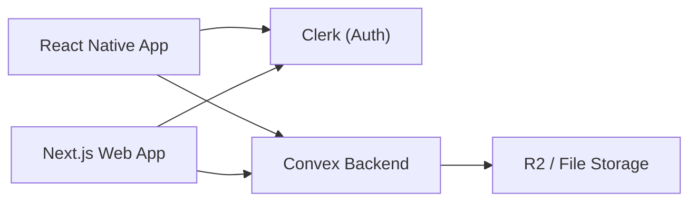

## Mobile app integration plan (

React Native + Clerk + Convex)

### 1. High-level architecture

- **Goal**: Make the new React Native mobile app a first-class client of your existing backend (Clerk auth + Convex + R2 storage), so users share the same accounts, credits, generations, and sessions across web and mobile.
- **Key pieces**:
- **Auth**: Same Clerk instance as the web app (same frontend API, instance, and JWT templates).
- **Backend**: Same Convex deployment and schema (e.g. `users`, `sessions`, `generations`, `subscriptions`).
- **Storage**: Same image/video storage (Cloudflare R2 or equivalent) referenced by Convex documents.
- **Clients**: Web (Next.js) and Mobile (React Native / Expo bare) both talk to Clerk + Convex; no separate mobile backend.

---

### 2. Set up shared configuration for mobile

- **Clerk configuration**
- Reuse the **same Clerk instance** as the web app (same dashboard project).
- In the mobile app, configure `publishableKey` / `frontendApi` to match the web app's environment (dev vs prod).
- Decide on the **OAuth redirect scheme** (e.g. `yourapp://auth/callback`) and configure it in:
    - Clerk dashboard (OAuth redirect URLs for Google).
    - `app.json` / `app.config.js` (Expo bare) for deep linking scheme.
- **Convex configuration**
- Use the same **Convex deployment URL** and **auth configuration** that the web app uses (see `convex/auth.config.js` in this repo).
- Expose the Convex URL and deployment name to mobile via `.env` and Expo config (e.g. `CONVEX_URL`, `CONVEX_DEPLOYMENT`).
- Share the generated Convex client types (`convex/_generated/api`) with the mobile app (via a small shared package, git submodule, or manual copy with a script).
- **Project dependencies (mobile)**
- Add (or confirm) dependencies such as:
    - `@clerk/clerk-expo` (or the appropriate Clerk package for Expo bare).
    - `convex` (for the Convex client & React hooks).
    - Offline + storage utilities: `@react-native-async-storage/async-storage` or `react-native-mmkv`, and a network state library like `@react-native-community/netinfo`.

---

### 3. Implement Clerk auth on mobile (Google login + Continue with email)

- **3.1 Initialize Clerk in the app root**
- Wrap your app in `ClerkProvider` at the top level (e.g. `App.tsx`):
    - Pass `publishableKey` / `frontendApi`.
    - Configure a **secure token cache** (e.g. using `SecureStore` or similar for Expo bare) so sessions persist across restarts.
- Set up **deep linking** handling for OAuth callbacks:
    - Define a linking scheme like `yourapp://`.
    - Configure linking in Expo and in Clerk dashboard (`Redirect URLs`).
- **3.2 Auth UI flows**
- **Welcome/Auth screen**: Present options for **“Continue with Google”** and **“Continue with email”**.
- **Google sign-in**:
    - Use Clerk's built-in Google OAuth for native (via `startOAuthFlow` from `@clerk/clerk-expo` or equivalent).
    - Handle redirect back into the app via deep link, then complete the OAuth flow with Clerk to create/sign in the user.
- **Continue with email**:
    - Support **email + password** or **email code/magic link**, whichever is currently enabled in your Clerk instance.
    - Either:
    - Use Clerk's prebuilt auth components (if available for React Native), or
    - Use Clerk's headless API (create/sign-in flows) with your own UI components.
- **Post-auth navigation**:
    - After successful sign-in/up, navigate to the main app stack (home/dashboard where image generation is available).
- **3.3 Session management and sign-out**
- In your **root navigator**, conditionally render either the Auth stack or the App stack based on Clerk's session state (`useAuth` / `useUser`).
- Implement **sign-out** in the profile/account screen using Clerk's signOut method; on success, reset navigation back to the auth stack.

---

### 4. Connect Convex to Clerk on mobile

- **4.1 Convex client + provider setup**
- Install `convex` in the mobile app and import the generated client from shared types (`convex/_generated/api`).
- At the top level (inside `ClerkProvider`), wrap your app with `ConvexProvider` (or `ConvexReactClient`) configured to:
    - Point to your existing Convex deployment.
    - Use a `getAuthToken` callback that pulls a **Clerk JWT** for the current user (e.g. via `getToken({ template: 'convex' })` if you have a template defined in Clerk).
- Coordinate with the backend dev to ensure `convex/auth.config.js` is correctly wired up to validate Clerk tokens, matching the web setup.
- **4.2 Authenticated queries and mutations**
- Ensure that all Convex functions that require auth (e.g. `generations`, `users`, `subscriptions`) already rely on Convex's `ctx.auth` (which is fed by Clerk JWTs).
- On mobile, simply call the same `useQuery`, `useMutation`, or `client.mutation` hooks used on web; Convex will receive the correct authenticated identity via the token.
- Verify that a user created on mobile (via Clerk) appears as the same user in Convex as when logging in via the web app.

---

### 5. Wire up image generation flows so they sync with web

- **5.1 Reuse existing backend flows**
- Identify how the web app currently triggers generations:
    - Either via **Convex mutations** (e.g. `api.generations.create`) or
    - Via **Next.js API routes** (e.g. `/api/generate-image`) that then call Convex and external providers.
- Prefer, for mobile, to **talk directly to Convex** using the same mutations/queries used on the web, to keep the client logic consistent.
- **5.2 Mobile-side generation UX**
- Implement a "Create" screen that mirrors the web experience:
    - Prompt input (prompt text, style, aspect ratio, model selector, etc. – match what web sends).
    - On submit, call the Convex mutation that creates a new generation job.
    - Navigate to a **generation detail / activity** screen that observes job status.
- Use Convex **real-time queries** to:
    - Watch the status of the current job (queued → running → complete / failed).
    - Fetch the user's list/grid of previous generations, ordered by time.
- **5.3 Asset URLs and R2 storage**
- Use the same Convex fields the web uses for images (e.g. URLs to R2, sizes, metadata).
- In mobile, load thumbnails / full-size images from those URLs with your image component.
- Confirm CORS/public access setup works for mobile clients (generally same as web if using HTTPS URLs).

---

### 6. Offline-first & robust sync design

- **6.1 Decide on local storage strategy**
- For **robust offline support**, pick a persistent storage layer:
    - Start with `AsyncStorage` or `MMKV` if requirements are simple (queue + cache), or
    - A local DB (e.g. SQLite via `expo-sqlite` or Realm) if you anticipate complex data and larger history.
- Create a small **data access layer** that abstracts local vs remote, rather than sprinkling storage calls throughout components.
- **6.2 Network state detection**
- Use `@react-native-community/netinfo` to maintain a global **online/offline status** observable.
- Show a small **offline banner** when disconnected, and disable or adjust actions that need the network.
- **6.3 Offline queue for generation requests**
- Define a local **`PendingGeneration`** structure that mirrors what Convex expects (prompt, model, options, etc.).
- When user submits while offline:
    - Store the generation request in a **local queue** with a local-only ID and timestamp.
    - Show it in the UI as **“Pending”** so the user sees it will be sent later.
- Implement a **sync worker** that:
    - Listens for transitions from offline → online.
    - Iterates through queued requests and sends them to Convex one by one.
    - For each successful remote creation, updates local storage with the server-side `generationId` and marks the local entry as synced.
    - Handles failures with retries and/or marking items as "Failed" with an option to retry manually.
- **6.4 Caching generated items for offline viewing**
- On successful sync and when online, fetch recent generations from Convex and store:
    - The metadata (prompt, status, timestamps, URLs) in local storage/DB.
    - Optional: download and locally cache thumbnails (e.g. via an image caching library) for faster offline viewing.
- When offline, render the gallery from this **local cache**, with clear indication that data might be slightly out of date.
- **6.5 Conflict and edge-case handling**
- Because generations are append-only in most systems, conflicts are minimal; treat Convex as source of truth.
- If the same pending generation is triggered again from web and mobile, simply show duplicates or use timestamp/model to de-duplicate visually if needed.
- Ensure that when a user logs out, you:
    - Clear any **user-specific** local data (pending queue, cached generations) or scope it by user ID so it doesn’t leak between accounts.

---

### 7. UI/navigation integration

- **7.1 Navigation structure**
- Auth stack: welcome → sign-in/up → forgot password / verification screens.
- App stack: home/dashboard → create screen → generation detail → profile/account.
- Ensure navigation is fully driven by **Clerk session state** and **Convex data** (e.g. credits/subscription from Convex if used on web).
- **7.2 Shared UX elements**
- Reuse wording, feature names, and general flows from the web app (e.g. credits, models list, subscriptions) so users feel it’s the same product.
- Include a **sync/status indicator** when:
    - There are pending offline actions.
    - The app is retrying sending queued generations.

---

### 8. Security, environments, and testing

- **8.1 Environment management**
- Define separate envs for **development**, **staging**, and **production** in the mobile app:
    - Each with its own Clerk `publishableKey` and Convex URL.
- Ensure sensitive keys are **not hard-coded**; use Expo config and build-time env injection.
- **8.2 Security considerations**
- Always request Convex tokens from Clerk securely via `getToken` (with a dedicated Convex JWT template if used on web).
- Avoid storing raw JWTs or refresh tokens in plaintext; rely on Clerk's secure storage helpers and platform-specific secure storage.
- **8.3 Testing scenarios for the dev**
- Auth:
    - New user signup via Google.
    - Existing web user logs in on mobile via Google.
    - Email flow (signup, login, password reset if applicable).
    - Deep link flow for Google OAuth on iOS and Android.
- Backend integration:
    - Generate from mobile, verify it appears on web (and vice versa).
    - Credits/subscriptions update correctly across platforms.
- Offline:
    - Start a generation while offline, then go online and confirm it syncs to Convex and appears on web.
    - Browse previously viewed generations while offline.

---

### 9. Handover checklist for your mobile developer

- **From this existing web repo** (backend expectations):
- List of **Convex functions** relevant to auth/session, user profile, credits/subscriptions, and generations (e.g. `generations.create`, `generations.listForUser`, `users.getOrCreate`, etc.).
- Any **Next.js API routes** that web currently uses for image generation, if those should remain the single source of truth instead of calling Convex directly.
- Confirmation of the **Convex auth setup** (Clerk JWT templates, auth config).
- **What the mobile dev should implement**:
- **Clerk auth flows** in React Native (Google + email) using `@clerk/clerk-expo` with deep linking.
- **Convex client integration** in React Native, reusing the same backend and types.
- **Image generation screens** mirroring web, wired to the existing Convex/Next.js flows.
- **Offline queue + cache** for generations using local storage and network state detection.
- **What to coordinate with backend/web dev**:
- Ensure any Convex functions or API routes have the right inputs/outputs documented for mobile.